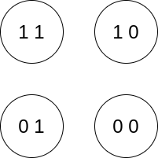
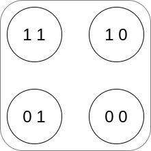
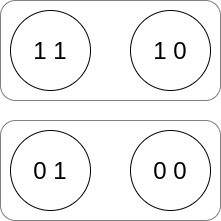
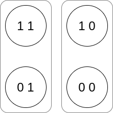

『ユリイカ』に寄稿したものの原稿です。手元にある最新のマークダウン・ファイルをそのまま写しただけなので、校正を経て雑誌に掲載されたものとは差分があります。

---------------

## クイズが可能であるために必要なものはなにだろうか？
クイズは、さまざまなかたちがある。出題の領域も、形式も、いろいろなものがある。出題の範囲は、プロ野球選手の出身地に関するトリビアから、冠婚葬祭の一般常識、はたまた最先端の物性化学の成果についてまでクイズの対象から逃れられるものはない。またやり方にしても、○×式、三択、四択、あてはまるものをn個挙げよ、時間制限、などなどクイズの形状は多様だ。

ただ、どのような形で運営されるにせよ、クイズはなにかしらの言語表現、より具体的にいうと、「質問」（それは多くの場合、語尾のイントネーションの変化や、あるいは疑問符「？」によって特徴づけられる）と、それへの「回答」を含む。質問がなければクイズはない。そして、回答を期待しないクイズはない。

ということは、クイズという営みが可能であるためには、人間の側に、それら質問の意味をじゅうぶん理解し、回答し、さらには、その回答の意味を理解したうえで回答として適切か否かを評価する、といったことができる能力が備わっている。そう考えても差し支えないだろう。では、われわれが質問を理解するとき、われわれはなにを理解してるのだろうか。

いちばん短い答えは、そういった質問文をみるときに、わたしたち言語に習熟した者たちは、みな同じものをみて了承しているからだ、ということだろう。質問には、言語に習熟した者ならばみなが理解している、なんらかの構造がある。このような仮説をおき、そのような意味を司る構造――意味論――を探求することにはそれなりの意義がありそうだ。

「茶碗蒸しはたまごを原料としているか？」「茶碗蒸しの原料はなにか？」といったようなの質問・疑問文の意味論については、言語学、形式的意味論、論理学などの形式的な分野で**inquisitive semantics**（定訳がまだみられないが、**審問的意味論**、くらいの含みだろうか？）」の名のもとに、近年、発展がみられる。この入門記事では、疑問文への意味の理論のさわりのさわりを、できるだけ簡潔に紹介する。簡単のため、この説明で扱う質問文は正誤問題（いわゆるマルバツクイズ）のそれにかぎっておく。より一般的な質問文の扱いについては参考文献を参照してほしい。質問文にかぎらず文の意味を可能世界の枠組みをもちいて解析するという、一九七〇年代以降の英語圏哲学を特徴づけるひとつの潮流についての前提知識である。その概説のあと、質問を扱うために必要な可能世界理論の技術的改良（のごく一端）を眺める。最後に、この疑問文の意味の解析から、クイズという営みについて言えそうなことを簡単に述べる。具体的には、クイズは共同体の知識を拡張する手段として簡便かつ有効ではないか、ということである。

## 文の意味を可能世界で説明できるか？
われわれが目指すゴールであるところの質問――たとえば「日本の首都は東京か？」や「日本の首都はどこか？」に向かうまえに、まずは平叙文の意味とはなにか、考えることからはじめよう。

ひとつの標準的な見方によれば、文章の意味とは、その文が正しくなるような状況のことである。たとえば、平叙文「日本の首都は東京である」の意味は、じっさいに日本の首都は東京であるような状況のことだといえばよい。

この例は、事実ただしい文であるので、あたりまえすぎて、ポイントが見えづらい。そこで、実際には正しくない文について考えよう。たとえば「日本の首都は名古屋である」などどうだろう。じっさいには日本の首都は名古屋ではなく東京なので、この文は正しくない。だが、だからといってこの文が無意味なわけではない。日本語の使い手ならばこの文章がどういうことを意味しているのかは理解しているだろう。そして、そのうえで、間違っている、と思うはずだ。

この文「日本の首都は名古屋である」を理解しているとき、その人は、日本の首都がじっさいに名古屋である状況がどのようなものかを把握しているのと同一視してよい。もしも名古屋が首都である様子、たとえば国会議事堂や首相官邸が名古屋の丸の内あたりにでき、標準語が名古屋弁アクセントになるだろうな、など、文が正しい場合の事態を想像できるということである。

たとえば、関東大震災が現実よりもさらに甚大であったため、あるいは、江戸無血開城が果たされずに荒廃したため、名古屋に遷都した――。実際そうはならなかったが起こる可能性はゼロではなかったろう。この、実際とは異なるが、しかし可能ではある状況のことを、用語として**可能世界**と呼ぶ。もしも考える文がひとつ（「名古屋が日本の首都である」）だけならば、必要な可能世界はそうである世界とそうでない世界のあわせた二つで用が足りる。より多くのn個の文を扱いたい場合、2のn階乗個の世界を用意してやる必要がある。ありとあらゆる文についての可能な状況を表現するため用意した世界のあつまりのことは、論理的には可能なパターンをすべて書き出していることから、**論理空間**と伝統的に呼ばれている。

図式的に整理しておこう。文Sの意味とは、その文Sを真にするような状況のこと、だととりあえず言っていい。たとえば、文「このうなぎは黒い」の意味は、項「このうなぎ」で指されているうなぎが黒い状況のことである。文Sの意味とはなにか、と問われたら、それはその文Sが真であるような可能世界をぜんぶ集めてきたもののことです、と答えることができる。

## 文の意味を動的（ダイナミック）に見るとはどういうことか？
会話や質問をふくむ言語活動は、その多くが、ダイナミクスのなかで――複数の担い手による、時間をとおした変遷のなかで――おこなわれる。会話を通して、たとえば新しいことを教えてもらったり、あるいは間違いを他人から指摘してもらったりする。やりとりの前後で、参加者の信念や知識の内容が変化している。

重要な点は、発しさえすればかならず意図したようなインパクトをもたらすわけではないということだ。あなたが「日本の首都は名古屋です」と言ったところで相手が信じて改訂してくれるかは、相手の日本の地理に関する知識、あるいは話者への信頼度など、話し手をとりまく状況に依存する。相手や共同体が受け入れるかの保証はなく、あくまで**提案**として処理される。

このような動的（ダイナミック）な観点から、文の意味、とはなにだろうか、ということを考えてみる。すると、文の意味は、**共通の土台 common ground**――会話の参加者どうしで共有されている情報――を、どれくらい、そしてどのように更新するかによって説明できる。

このダイナミクスを、さきほどの可能世界のフレームワークにあてこんで考えると、次のような感じになる。文の意味は、目下、話者たちが念頭においている可能世界の一群を、どれくらい**絞りこむ**か、によって定まる。[^1]
[^1]: これらの方針にもっとも強く影響を与えたのはStalnakerの以下の仕事だろう。Stalnaker, Robert C. “Assertion.” In Formal Semantics, edited by Paul Portner and Barbara H. Partee, 147–61. Oxford, UK: Blackwell Publishers Ltd, 2008.

具体例を見ていこう。「柳生十兵衛はスパイだった」という文がもつ意味（情報、といったほうが直観的にとおりがいいかもしれない）は、それを発言し、たとえば正しいと認めることでいったいどれくらいの可能世界が削られるか、によって測られる。たとえば「柳生十兵衛はスパイだった」――この文章が真なのか偽なのかはわたしにはわからない。ただ、すくなくとも、この文は、「柳生十兵衛はスパイだった」が偽である、要は柳生十兵衛はスパイではなかったような可能な状況を、いまかんがえているありうる状況たちのプールからとりのぞくというような提案を会話にもたらす。もし受入れられるのならば、会話の参加者たちは、これ以降、十兵衛がスパイでなかったという状況については検討しない、ということだ。

## ダイナミックな可能世界意味論は質問を扱えるか？
さて、ここまでの枠組み――可能世界と、そのうえを走るダイナミクス――で、われわれのターゲットである質問を扱うことはできるのか？

さきに結論を言っておくと、基本的なアイディアは流用できるものの、質問に意味を与えるには、粗すぎてそのままでは使いものにはならない。とはいうものの、この失敗談をふまえずに意味論に突入してもいまいちポイントというかありがたみがわかりづらいだろうから、いかにして失敗するのかの説明をしておく。

話し手どうしの共有更新の度合いによって文の意味をとらえるというアイディアは使えそうだ。われわれのターゲットとなっているマルバツ問題の場合は、イエスの場合「名古屋は日本の首都である」もノーの場合「名古屋は日本の首都ではない」もどちらもありうるぞ、という選択肢を提案し、その選択肢のなかから選ぶことを現在の話題にせよ、という**提案**を回答者にむかっておこなっているのだとみることができる。これは「または」を用いた文「名古屋は日本の首都であるか、**または**、そうではないか」（が正しい）という主張を行うことに非常に近い。このことをふまえると、次のようなことを言ってもよさそうだ。

質問は目下、考慮している可能世界をしぼるような提案ではない。

質問「目黒駅は目黒区にあるか？」をたずねた時点では、目黒駅は目黒区にあるか、それともそうではないのか、について、どちらでもありうる、という状態のはずだ。目黒駅は目黒区にあるか、あるいはそうでないのかどちらか、と尋ねているのであって、そのどちらかだ、と提案しているのではない。

ただ、ここで、問題がおきる。というのも、わたしたちは当然のように異なる質問の異なる意味が捉えられるが、古典的な可能世界の枠組みだと区別ができなくなってしまう。

たとえば次の二つのような質問を考えてみよう。

質問M「目黒駅は目黒区にありますか？」

質問N「日本の首都は名古屋ですか？」

話を単純にするために、世の中にごまんとあるほかの質問や文についてはすっかりわすれて、このふたつの文だけを考える。すると、質問MもNもどちらもイエス（1,1）Mだけがイエス(1,0)、Nだけがイエス(0,1)、両方ノー(0,0)と、全部で2×2=4とおりの可能世界を考えることができる。

さっきまでの話をふまえると、質問Mは、「目黒駅は目黒区にある」可能性(1,1),(1,0)、そして「目黒駅は目黒区にない」可能性(0,1),(0,0)どちらも開けておくことである。つまり、現在、検討されている４つの可能世界をすべて残しておくことである。転じて、質問Nも、「日本の首都は名古屋である」(1,1),(0,1)「日本の首都は名古屋ではない」(1,0), (0,0) 両方の可能性をあけておくことである。これもまた目下検討中の４つの可能世界すべてを残すことである。

これでは、どちらも、質問がさししめすことが、いま想定している世界（４つ）すべてになってしまい、ほんらいつけるべき区別がつけられなくなってしまう。

もっというと、これだと、マルバツ問題はありとあらゆるトートロジーとおなじ意味だということになってしまう。

これら"二つの疑問の意味はあきらかに違う。Mは目黒駅について、Nは日本の首都についての問題である。このままでは目が粗すぎて実用にむかない。疑問文の意味をきちんと表現するためには、可能世界の枠組みよりもより詳細で細かな網目を用意してくれる意味論的道具がわたしたちには必要だ。

## 疑問文の意味論とはどういうものか？
ここからが疑問文意味論の紹介である。イエス・ノーで応えられるタイプの疑問以外の、疑問表現一般のみならず、その対となる主張も統合的に説明できる枠組みがすでに展開されている。[^2]が、ここでその形式的詳細を伝えていると紙面や趣旨からはみだしてしまうので、あくまで、イエス・ノーで答えられる、いわゆるマルバツ問題に話を絞って説明をしよう。
[^2]:　以下のものが、動機の説明や例も豊富でわかりよい。 Ciardelli, Ivano, Jeroen Groenendijk, and Floris Roelofsen. Inquisitive Semantics. Oxford University Press, 2018.

引き続き、質問MとNとを考えよう。
このとき、想定している世界はぜんぶあわせて2×2=4つであることは、変わらない。ただし、ここで、可能世界とは区別される、可能世界をよせあつめた**選択肢**なる概念を導入する。具体的にいうと「目黒駅は目黒区にある」が真である世界をくっつけたものを、つまり具体的には(1,1)と(1,0)をあわせたもの\{[1,1][1,0]\}を[M]と書き、「目黒駅は目黒区にある」選択肢とよんでおく。同様に、その否定「目黒駅は目黒区にはない」¬Mという選択肢[¬M]は\{(0,1)(0,0)\}のこととする。同様に、N、¬Nについても考える。

準備は整った。質問の意味とはなにか？　それは、論理空間に選択肢で**区切る**提案のことである。質問は主張ではないから、検討する可能世界を削るのはおかしい。しかし、だからといってそのまま残すと、異なる質問が区別できなくなってしまった。そこで、可能世界をあつめたものを意味とするのではなく、可能世界をあつめたもの（選択肢）をさらにあつめたものを質問の意味だと考える。このようにすれば、垂直方向に区切っている質問Mと水平方向に区切っている質問Nとして、質問の意味内容を区別することができる。

## クイズはなにの役に立つか？
さて、ここまでクイズなる営みを可能にする、わたしたち人間がもっているはずの疑問文の理解――それを説明する構造をあらわす意味論のアイディアを、いささか簡素ではあるが、説明した。[^3]

[^3]: ここではかなりカジュアルな言葉づかいで話をすすめたが、よりフォーマルな議論や、言語哲学にまつわる背景、そしてほかの論理体系への接続などが気になる人は、前述のCiardelli本などを参照してほしい。

最後に、これらの枠組みをふまえて、質問という形式自体が情報伝達においてすぐれている点を指摘したい。

質問はそれじたいが情報をつたえるものではない。それは、上の意味論でも、質問文は可能世界のプールを削るものではない、と考えたとおりだ。しかし、だからといって情報伝達や、共同体の知識拡張にかんしてまったく役に立たないわけではない。目下、話題にしたいことはなにか、そしてそのときの観点はなになのか、についていくらかの情報を伝えてくれる。

質問というかたちで持ちだしておいてから、考えさせて、回答を提示する。これは説明の様式として一般的にいって利点のある順序である、といえるだろう。というのも、ふつう、文章を書くときは、文脈を提示しておいてから、つまり大きい間口からはいっておいて、徐々に核心、というかよりくわしいパートにはいっていく。概論から各論へ。文章作法で教わることだ。なぜそのように書くのが好ましいとされるかといえば、そのような順序が、読む側との共通知識をうめていくのに適しているからだ。それは、違うこと、とくにレヴェルの異なることを同時に言われては理解が追いつかないという人間側の処理機構の問題のように思える。

というわけで、クイズ形式、というものは、実は情報伝達、とくに未知を既知に変化させる学習のための形式としてかなり優れている。なにしろ、質問さえすれば、情報にいたるまでの筋道をかなり勝手に導入してくれて、その機微に頭を悩ませる必要がなくなる。クイズはたとえば学習の成果の確認にまず使われることが多い。確認テストの類も、英語だと「クイズ」であるように。しかし、むしろ新しいことを知る際に、クイズの様式はその能力を発揮する。前提知識を把握し、そのうえで適切な前提をそろえる条件をだし、そのうえでもっていきたい主張に導く。前提知識をそろえることは丁寧にやらなくては脱落者がでるし、かといって丁寧にやりすぎると飽きられる。前提知識を測定する困難もある。これらの問題系を、クイズの実施は、すべてではないにせよ、容易に解消する。効率的に前提知識の測定をしつつ、問いそれ自体で文脈が導入できる。さらに、サスペンス効果もあり引きもよい。

量産されるブログ記事が「ご存知でしょうか」ととりあえず疑問文ではじまる定形は、どれくらい成功しているかの程度問題は措くが、おそらくこの機能を念頭においている。また、「身の回りのモノ・コトをクイズで理解する」ことをめざすという「クイズノック」のプロジェクト[^4]も、応用例のひとつに数えることができるだろう。

[^4]: https://quizknock.com/
